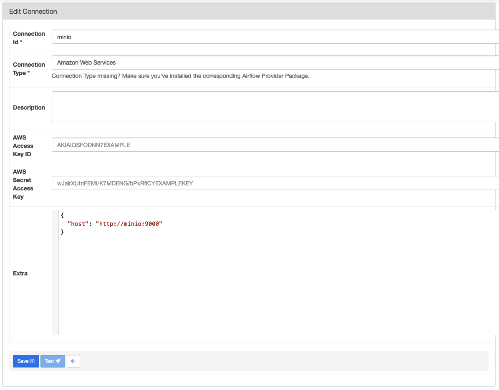

# Data Pipelines with Airflow

## Contents

- Prerequisites
  - [Installing Docker Desktop](./docs/installing-docker-desktop.md)
  - [Installing Visual Studio Code](./docs/installing-vscode.md)
- [Data Source](#data-source)
- [Starting Airflow](#starting-airflow)
- [Project Instruction](./docs/project-instruction.md)
- [Airflow S3 Connection to MinIO](#airflow-s3-connection-to-minio)
- [Running Tests](#running-tests)
- [References](#references)

## Data Source

- [CCXT - CryptoCurrency eXchange Trading Library](https://github.com/ccxt/ccxt)
- [Hello, CCXT!](https://github.com/zkan/hello-ccxt)

## Starting Airflow

Before we run Airflow, let's create these folders below first. Please note that if you're using Windows, you can skip this step.

```sh
mkdir -p mnt/dags mnt/logs mnt/plugins mnt/tests
```

On **Linux**, please make sure to configure the Airflow user for the docker-compose:

```sh
echo -e "AIRFLOW_UID=$(id -u)" > .env
```

With `LocalExecutor`

```sh
docker-compose build
docker-compose up
```

With `CeleryExecutor`

```sh
docker-compose -f docker-compose-celery.yml build
docker-compose -f docker-compose-celery.yml up
```

With `SequentialExecutor` (NOT recommended for production use)

```sh
docker-compose -f docker-compose-sequential.yml build
docker-compose -f docker-compose-sequential.yml up
```

To clean up the project, press Ctrl+C then run:

```sh
docker-compose down
```

## Airflow Connection to MinIO

Since MinIO offers S3 compatible object storage, we can set the connection type to "Amazon Web Services". However, we'll need to set an extra option, so that Airflow connects to MinIO instead of S3.

- Connection Name: `minio` or any name you like
- Connection Type: Amazon Web Services
- AWS Access Key ID: `<replace_here_with_your_minio_access_key>`
- AWS Secret Access Key: `<replace_here_with_your_minio_secret_key>`
- Extra: a JSON object with the following properties:
  ```json
  {
    "host": "http://minio:9000"
  }
  ```

See the example below:



**Note:** If you were using AWS S3 already, you don't need to specify the host in the extra.

## Running Tests

First we need to install pytest:

```sh
pip install pytest
```

Run tests:

```sh
export PYTHONPATH=/opt/airflow/plugins
pytest
```

## References

- [Running Airflow in Docker](https://airflow.apache.org/docs/apache-airflow/stable/start/docker.html)
- [MinIO Docker Quickstart Guide](https://docs.min.io/docs/minio-docker-quickstart-guide.html)
- [Deploy MinIO on Docker Compose](https://docs.min.io/docs/deploy-minio-on-docker-compose)
